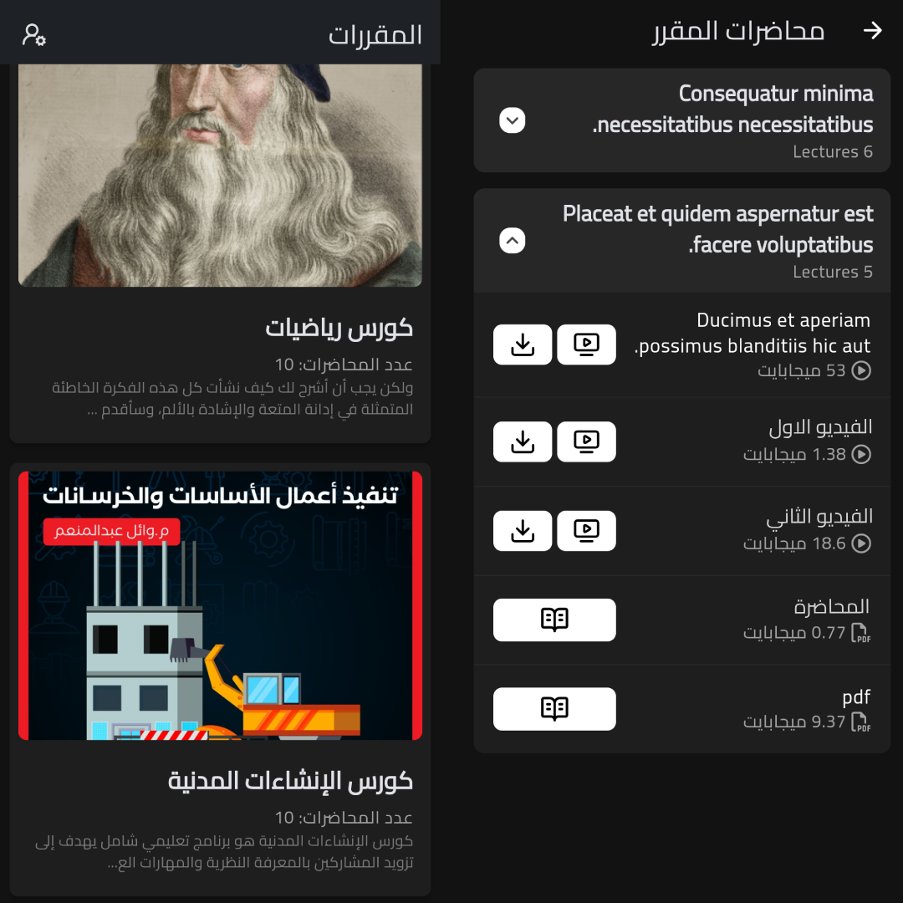
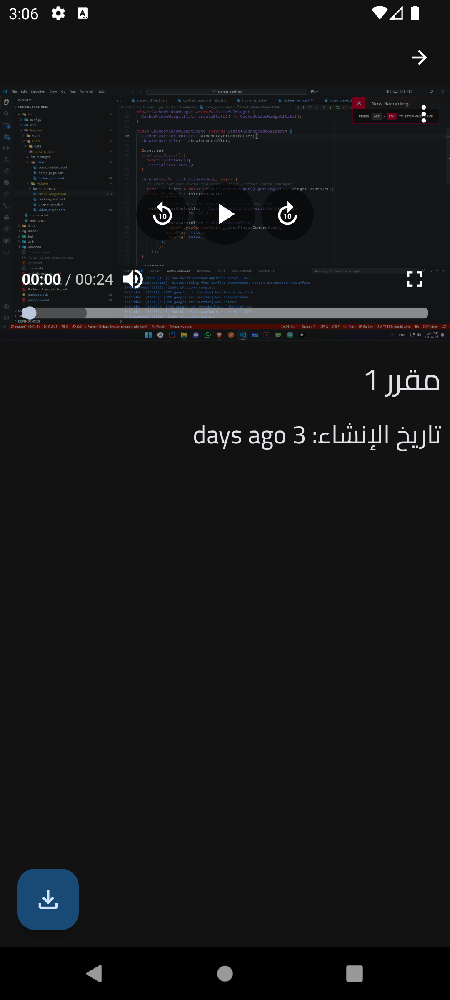
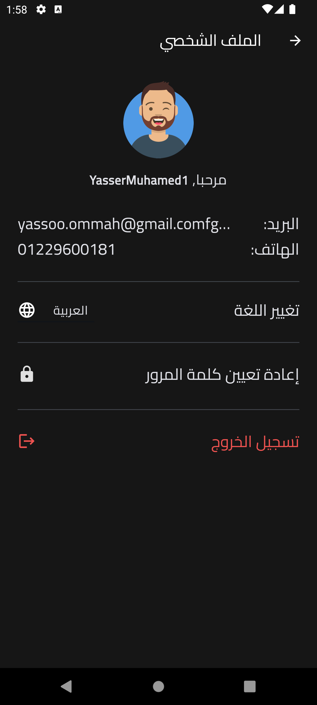
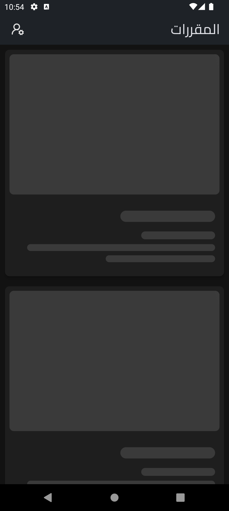

# Courses Platform

## 🖼 Screenshots

| Video Lecture                            | Profile Page                           |
| ---------------------------------------- | ------------------------------------ |
|  |  |

| Home Loading Page                       | Course Loading Details                                |
| ------------------------------- | --------------------------------------------- |
|  |  |

## 🚀 Overview
The **Courses Platform** is a Flutter-based mobile application designed for online learning. It provides a seamless experience for students and instructors by offering a structured way to access educational content. 

### Key Features:
- 🎥 **Lecture Viewing:** Supports both video lectures and PDF course materials.
- 🔐 **Authentication & Security:** Uses Firebase Authentication or JWT-based login systems.
- 🌙 **Dark Mode Support:** Fully optimized for dark mode.

This platform is designed to be scalable and can integrate with different backends, making it a versatile solution for e-learning applications.

## 🛠 Technologies

- **Framework:** Flutter
- **State Management:** Cubit / Bloc
- **Database:** API
- **Authentication:** JWT
- **UI Components:** Material Design / Custom Widgets

---

⭐ Don't forget to star this repo if you find it useful! ⭐
